# ER図（データベース設計）

> **Version**: 3.1
> **更新日**: 2026年1月30日
> **基準**: システム仕様書 v1.3
>
> **変更履歴**
> - v3.1 (2026-01-30): 案件ステータスから `completed` を削除、`problem` を追加

## 概要

{{COMPANY_NAME_SHORT}} 人員配置・勤怠・請求 管理システムのデータベース設計図。

- **マスターテーブル**: 5テーブル
- **トランザクションテーブル**: 5テーブル
- **ログテーブル**: 1テーブル
- **合計**: 11テーブル

## テーブル一覧

### マスターテーブル（5テーブル）

| テーブル名 | シート名 | 用途 |
|------------|----------|------|
| M_Customers | 顧客 | 顧客マスター |
| M_Staff | スタッフ | スタッフマスター |
| M_Subcontractors | 外注先 | 外注先マスター |
| M_TransportFee | 交通費 | 交通費エリア別マスター |
| M_Company | 自社情報 | 自社情報マスター（1レコード） |

### トランザクションテーブル（5テーブル）

| テーブル名 | シート名 | 用途 |
|------------|----------|------|
| T_Jobs | 案件 | 案件トランザクション |
| T_JobAssignments | 配置 | 配置トランザクション |
| T_Invoices | 請求 | 請求トランザクション |
| T_InvoiceLines | 請求明細 | 請求明細トランザクション |
| T_Payouts | 支払 | 支払トランザクション |

### ログテーブル（1テーブル）

| テーブル名 | シート名 | 用途 |
|------------|----------|------|
| T_AuditLog | ログ | 操作ログ（監査用） |

---

## ER図

```mermaid
erDiagram
    %% ========================================
    %% {{COMPANY_NAME_SHORT}} 人員配置・勤怠・請求 管理システム
    %% ER図 Ver 3.0
    %% ========================================

    %% ==========================================
    %% マスターテーブル (5テーブル)
    %% ==========================================

    M_Customers {
        string customer_id PK "顧客ID (UUID)"
        string company_name "会社名 [必須]"
        string branch_name "支店・営業所名"
        string department_name "部署名"
        string contact_name "担当者名"
        string honorific "敬称 (様/御中)"
        string postal_code "郵便番号"
        string address "住所"
        string phone "電話番号"
        string fax "FAX番号"
        string email "メールアドレス"
        number unit_price_tobi "鳶単価(税抜)"
        number unit_price_age "揚げ単価(税抜)"
        number unit_price_tobiage "鳶揚げ単価(税抜)"
        number unit_price_half "ハーフ単価(税抜)"
        number closing_day "締め日 (1-31)"
        number payment_day "支払日"
        number payment_month_offset "支払月 (0:当月/1:翌月/2:翌々月)"
        string invoice_format "請求書書式 (format1/format2/format3/atamagami)"
        number tax_rate "消費税率 (default:10%)"
        number expense_rate "諸経費率 (頭紙用)"
        string shipper_name "荷主名"
        string customer_code "顧客コード"
        string invoice_registration_number "インボイス登録番号 (T+13桁)"
        string folder_id "関連フォルダID"
        string notes "備考"
        datetime created_at "作成日時 [必須]"
        datetime updated_at "更新日時 [必須]"
        boolean is_active "有効フラグ [必須]"
    }

    M_Staff {
        string staff_id PK "スタッフID (UUID)"
        string name "氏名 [必須]"
        string name_kana "氏名カナ"
        string phone "電話番号"
        string line_id "LINE ID"
        string postal_code "郵便番号"
        string address "住所"
        boolean has_motorbike "バイク保有フラグ"
        string skills "スキル (鳶/揚げ/鳶揚げ) CSV"
        string ng_customers "NG顧客ID一覧 CSV"
        number daily_rate_half "日給(ハーフ)"
        number daily_rate_basic "日給(基本)"
        number daily_rate_fullday "日給(終日)"
        number daily_rate_night "日給(夜間)"
        number daily_rate_tobi "日給(鳶) ※鳶揚げ=鳶×1.5"
        string staff_type "種別 (regular/student/sole_proprietor/subcontract) [必須]"
        string subcontractor_id FK "外注先ID"
        string ccus_id "技能者ID (CCUS)"
        date birth_date "生年月日"
        string gender "性別 (male/female)"
        string blood_type "血液型"
        string emergency_contact "緊急連絡先"
        string job_title "職種"
        string health_insurance_number "健康保険種別"
        string pension_type "年金保険種別"
        string employment_insurance_no "雇用保険番号(下4桁)"
        string kensetsu_kyosai "建退共 (有/無)"
        string chusho_kyosai "中退共 (有/無)"
        string special_training "特別教育 CSV"
        string skill_training "技能講習 CSV"
        string licenses "免許 CSV"
        date hire_date "雇入日"
        string foreigner_type "外国人区分"
        string notes "備考"
        datetime created_at "作成日時 [必須]"
        datetime updated_at "更新日時 [必須]"
        boolean is_active "有効フラグ [必須]"
    }

    M_Subcontractors {
        string subcontractor_id PK "外注先ID (UUID)"
        string company_name "会社名 [必須]"
        string contact_name "担当者名"
        string phone "電話番号"
        string notes "備考"
        string folder_id "関連フォルダID"
        datetime created_at "作成日時 [必須]"
        datetime updated_at "更新日時 [必須]"
        boolean is_active "有効フラグ [必須]"
    }

    M_TransportFee {
        string area_code PK "エリアコード"
        string area_name "エリア名 (23区内/23区外等) [必須]"
        number default_fee "デフォルト交通費 [必須]"
    }

    M_Company {
        string company_id PK "会社ID (1レコード)"
        string company_name "会社名 [必須]"
        string postal_code "郵便番号 [必須]"
        string address "住所 [必須]"
        string phone "電話番号 [必須]"
        string fax "FAX番号"
        string invoice_registration_number "インボイス登録番号 [必須]"
        string bank_name "振込先銀行名 [必須]"
        string bank_branch "支店名 [必須]"
        string bank_account_type "口座種別 (普通/当座) [必須]"
        string bank_account_number "口座番号 [必須]"
        string bank_account_name "口座名義 [必須]"
        string logo_file_id "ロゴ画像ファイルID"
        string stamp_file_id "印影画像ファイルID"
        datetime updated_at "更新日時 [必須]"
    }

    %% ==========================================
    %% トランザクションテーブル (5テーブル)
    %% ==========================================

    T_Jobs {
        string job_id PK "案件ID (UUID)"
        string customer_id FK "顧客ID [必須]"
        string site_name "現場名 [必須]"
        string site_address "現場住所"
        date work_date "作業日 [必須]"
        string time_slot "時間区分 [必須] (jotou/shuujitsu/am/pm/yakin/mitei)"
        time start_time "開始時間"
        number required_count "必要人数 [必須]"
        string job_type "作業種別 (鳶/揚げ/鳶揚げ) [必須]"
        string supervisor_name "担当監督名"
        string order_number "発注ナンバー"
        string branch_office "営業所"
        string property_code "物件コード"
        string construction_div "担当工事課"
        string status "ステータス [必須] (pending/assigned/hold/cancelled/problem)"
        string notes "備考"
        datetime created_at "作成日時 [必須]"
        datetime updated_at "更新日時 [必須]"
        string created_by "作成者 [必須]"
    }

    T_JobAssignments {
        string assignment_id PK "配置ID (UUID)"
        string job_id FK "案件ID [必須]"
        string staff_id FK "スタッフID [必須]"
        string worker_type "種別 (STAFF/SUBCONTRACT) [必須]"
        string subcontractor_id FK "外注先ID"
        string display_time_slot "表示時間区分 [必須]"
        string pay_unit "給与区分 [必須] (FULLDAY/HALFDAY/HOURLY等)"
        string invoice_unit "請求区分 [必須]"
        number wage_rate "給与単価(上書き用)"
        number invoice_rate "請求単価(上書き用)"
        string transport_area "交通費エリア"
        number transport_amount "交通費金額"
        boolean transport_is_manual "交通費手入力フラグ"
        string site_role "現場役割 (作業員名簿用)"
        date entry_date "入場年月日"
        date safety_training_date "受入教育実施日"
        string status "ステータス [必須] (ASSIGNED/CONFIRMED/CANCELLED)"
        datetime created_at "作成日時 [必須]"
        datetime updated_at "更新日時 [必須]"
    }

    T_Invoices {
        string invoice_id PK "請求ID (UUID)"
        string invoice_number "請求番号 (YYMM_SEQ) [必須]"
        string customer_id FK "顧客ID [必須]"
        number billing_year "請求対象年 [必須]"
        number billing_month "請求対象月 [必須]"
        date issue_date "発行日 [必須]"
        date due_date "支払期限"
        number subtotal "小計(税抜) [必須]"
        number expense_amount "諸経費(税抜)"
        number tax_amount "消費税額 [必須]"
        number total_amount "合計金額(税込) [必須]"
        string invoice_format "使用書式 [必須]"
        string shipper_name "荷主名"
        string pdf_file_id "PDF ファイルID"
        string excel_file_id "Excel ファイルID"
        string sheet_file_id "編集用SpreadsheetID"
        string status "ステータス [必須] (draft/issued/sent/paid)"
        string notes "備考"
        datetime created_at "作成日時 [必須]"
        datetime updated_at "更新日時 [必須]"
        string created_by "作成者 [必須]"
    }

    T_InvoiceLines {
        string line_id PK "明細ID (UUID)"
        string invoice_id FK "請求ID [必須]"
        number line_number "行番号 [必須]"
        date work_date "作業日 [必須]"
        string job_id FK "案件ID"
        string assignment_id FK "配置ID"
        string site_name "現場名 [必須]"
        string item_name "品目 [必須]"
        string time_note "時間/備考"
        number quantity "数量 [必須]"
        string unit "単位 (人/式) [必須]"
        number unit_price "単価(税抜) [必須]"
        number amount "金額(税抜) [必須]"
        string order_number "発注ナンバー (様式2用)"
        string branch_office "営業所 (様式2用)"
        string construction_div "担当工事課 (様式3用)"
        string supervisor_name "担当監督名 (様式3用)"
        string property_code "物件コード (様式3用)"
        number tax_amount "消費税額"
        datetime created_at "作成日時 [必須]"
        datetime updated_at "更新日時 [必須]"
    }

    T_Payouts {
        string payout_id PK "支払ID (UUID)"
        string payout_type "支払区分 (staff/subcontractor) [必須]"
        string staff_id FK "スタッフID"
        string subcontractor_id FK "外注先ID"
        number billing_year "対象年 [必須]"
        number billing_month "対象月 [必須]"
        number base_amount "基本支払額(税抜) [必須]"
        number transport_amount "交通費合計"
        number adjustment_amount "調整額"
        number tax_amount "源泉/消費税額"
        number total_amount "支払総額 [必須]"
        string status "ステータス [必須] (draft/confirmed/paid)"
        date paid_date "支払日"
        string notes "備考"
        datetime created_at "作成日時 [必須]"
        datetime updated_at "更新日時 [必須]"
    }

    %% ==========================================
    %% ログテーブル (1テーブル)
    %% ==========================================

    T_AuditLog {
        string log_id PK "ログID (UUID)"
        datetime timestamp "日時 [必須]"
        string user_email "操作ユーザー [必須]"
        string action "操作 (CREATE/UPDATE/DELETE) [必須]"
        string table_name "対象テーブル [必須]"
        string record_id "対象レコードID [必須]"
        string before_data "変更前データ (JSON)"
        string after_data "変更後データ (JSON)"
    }

    %% ==========================================
    %% リレーションシップ
    %% ==========================================

    %% 顧客 → 案件 (1:N)
    M_Customers ||--o{ T_Jobs : "発注"

    %% 顧客 → 請求 (1:N)
    M_Customers ||--o{ T_Invoices : "請求先"

    %% 案件 → 配置 (1:N)
    T_Jobs ||--o{ T_JobAssignments : "配置"

    %% スタッフ → 配置 (1:N)
    M_Staff ||--o{ T_JobAssignments : "割当"

    %% 外注先 → スタッフ (1:N)
    M_Subcontractors ||--o{ M_Staff : "所属"

    %% 外注先 → 配置 (1:N)
    M_Subcontractors ||--o{ T_JobAssignments : "外注配置"

    %% 交通費マスター → 配置 (1:N)
    M_TransportFee ||--o{ T_JobAssignments : "エリア参照"

    %% 請求 → 請求明細 (1:N)
    T_Invoices ||--o{ T_InvoiceLines : "明細"

    %% 案件 → 請求明細 (1:N)
    T_Jobs ||--o{ T_InvoiceLines : "紐付け"

    %% 配置 → 請求明細 (1:N)
    T_JobAssignments ||--o{ T_InvoiceLines : "紐付け"

    %% スタッフ → 支払 (1:N)
    M_Staff ||--o{ T_Payouts : "給与"

    %% 外注先 → 支払 (1:N)
    M_Subcontractors ||--o{ T_Payouts : "外注費"
```

---

## リレーションシップ

### 主要な関連

| 親テーブル | 子テーブル | 関係 | 説明 |
|------------|------------|------|------|
| M_Customers | T_Jobs | 1:N | 顧客が案件を発注 |
| M_Customers | T_Invoices | 1:N | 顧客への請求 |
| T_Jobs | T_JobAssignments | 1:N | 案件にスタッフを配置 |
| M_Staff | T_JobAssignments | 1:N | スタッフが案件に割当 |
| M_Subcontractors | M_Staff | 1:N | 外注スタッフの所属 |
| M_Subcontractors | T_JobAssignments | 1:N | 外注先経由の配置 |
| M_TransportFee | T_JobAssignments | 1:N | 交通費エリアの参照 |
| T_Invoices | T_InvoiceLines | 1:N | 請求書の明細行 |
| T_Jobs | T_InvoiceLines | 1:N | 案件と請求明細の紐付け |
| T_JobAssignments | T_InvoiceLines | 1:N | 配置と請求明細の紐付け |
| M_Staff | T_Payouts | 1:N | スタッフへの給与支払 |
| M_Subcontractors | T_Payouts | 1:N | 外注先への支払 |

### 記号の意味

| 記号 | 意味 |
|------|------|
| `\|\|` | 1（必須） |
| `o{` | 0以上（任意） |
| `\|\|--o{` | 1対多（1:N） |
| PK | Primary Key（主キー） |
| FK | Foreign Key（外部キー） |

---

## 共通カラム

全テーブルに以下の共通カラムを付与（競合検知・監査・移行容易化のため）:

| カラム | 型 | 用途 |
|--------|-----|------|
| id | STRING(UUID) | 主キー（行番号依存を避ける） |
| created_at | DATETIME(ISO) | 作成日時 |
| created_by | STRING(email) | 作成者 |
| updated_at | DATETIME(ISO) | 更新日時（楽観ロックに使用） |
| updated_by | STRING(email) | 更新者 |
| is_deleted | BOOL | 論理削除（検索で除外） |

---

## 備考

### time_slot（時間区分）の値

| 値 | 表示名 | 説明 |
|----|--------|------|
| jotou | 上棟 | 棟上げ作業案件 |
| shuujitsu | 終日 | 終日作業案件 |
| am | AM | 午前作業案件 |
| pm | PM | 午後作業案件 |
| yakin | 夜勤 | 夜間作業案件 |
| mitei | 未定 | 開始時間未確定案件 |

### status（案件ステータス）の値

| 値 | 表示名 | 説明 |
|----|--------|------|
| pending | 未配置 | スタッフ未割当 |
| assigned | 配置済 | スタッフ割当完了 |
| hold | 保留 | 一時保留中 |
| cancelled | キャンセル | 案件キャンセル |
| problem | 問題あり | 問題発生 |

### invoice_format（請求書書式）の値

| 値 | 説明 |
|----|------|
| format1 | 様式1（{{FORMAT1_TYPE}}型） |
| format2 | 様式2（{{FORMAT2_TYPE}}型） |
| format3 | 様式3（{{FORMAT3_TYPE}}型） |
| atamagami | 頭紙（{{ATAMAGAMI_TYPE}}型） |

---

## 関連ドキュメント

- [05_database.md](05_database.md) - データベース設計詳細
- [06_backend.md](06_backend.md) - API設計・競合制御
- [ADR-003](../04_adr/ADR-003_pay_unit_invoice_unit.md) - pay_unit/invoice_unit分離の決定
