# サンプル建設 システム シーケンス図

**作成日**: 2025年12月18日  
**対象**: 人員配置・勤怠・請求 管理システム

---

## 1. ダッシュボード表示フロー

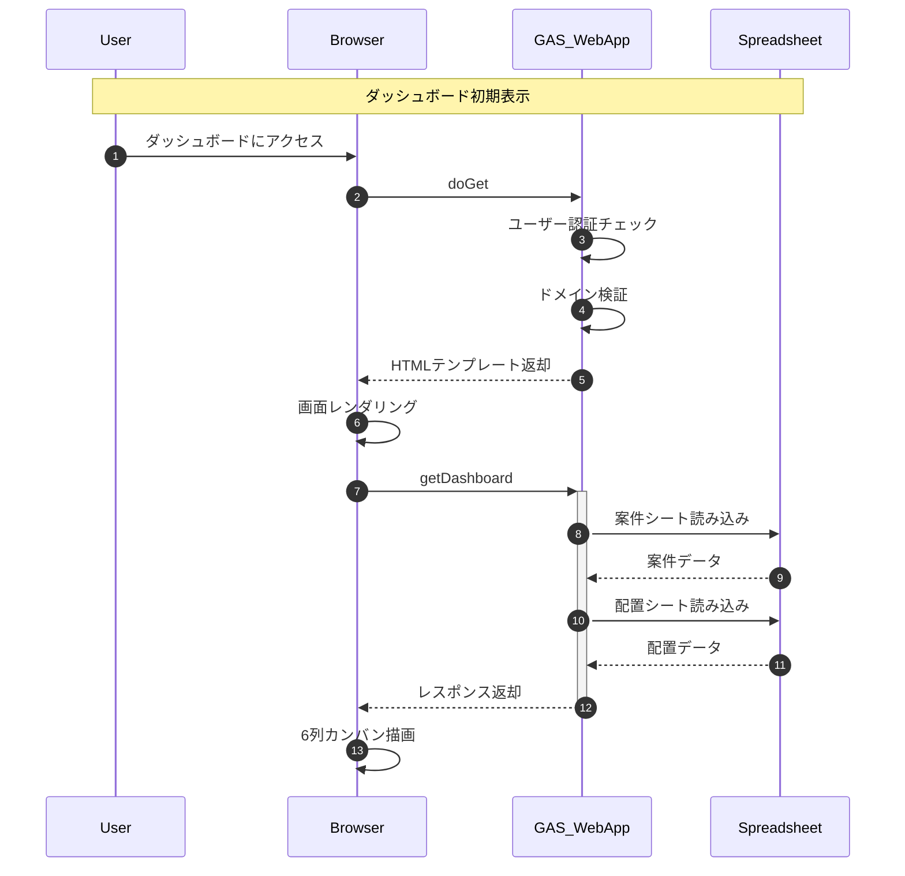

---

## 2. 案件新規登録フロー

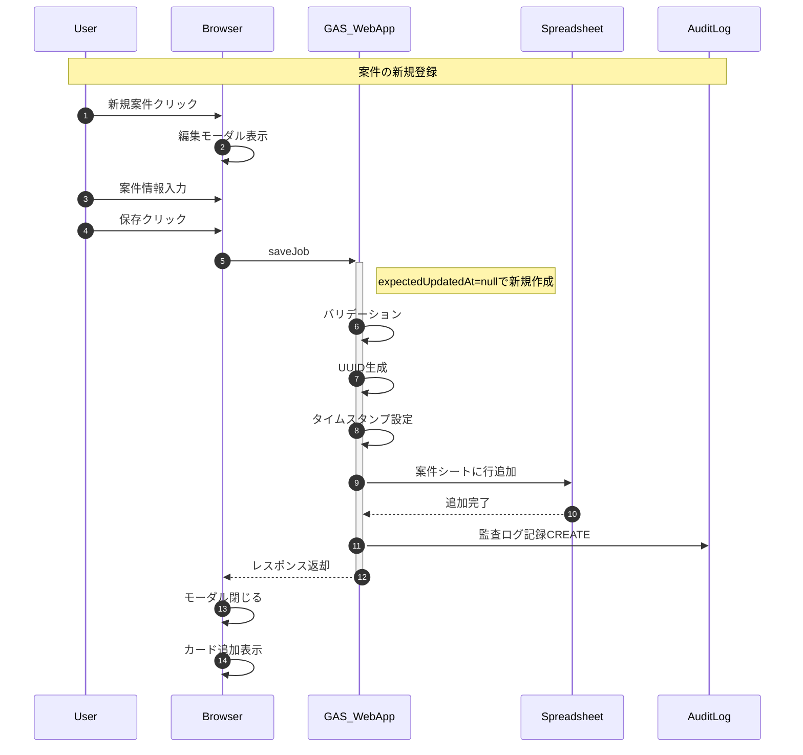

---

## 3. 案件更新フロー（競合なし）

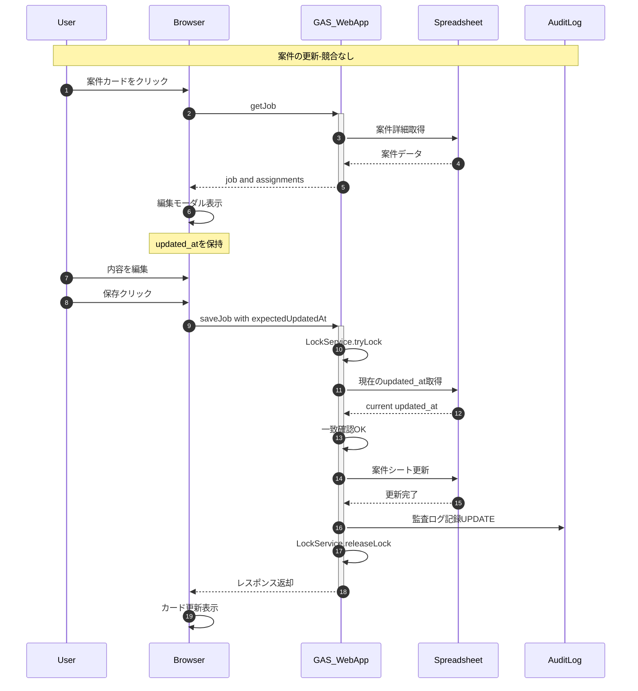

---

## 4. 案件更新フロー（競合発生）

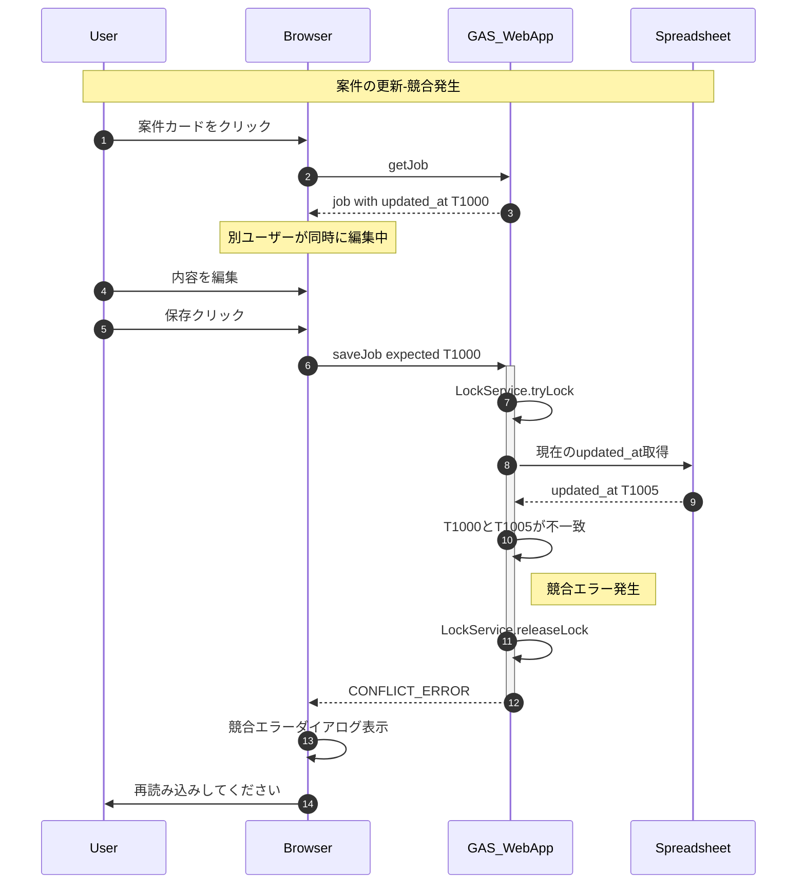

---

## 5. スタッフ配置フロー

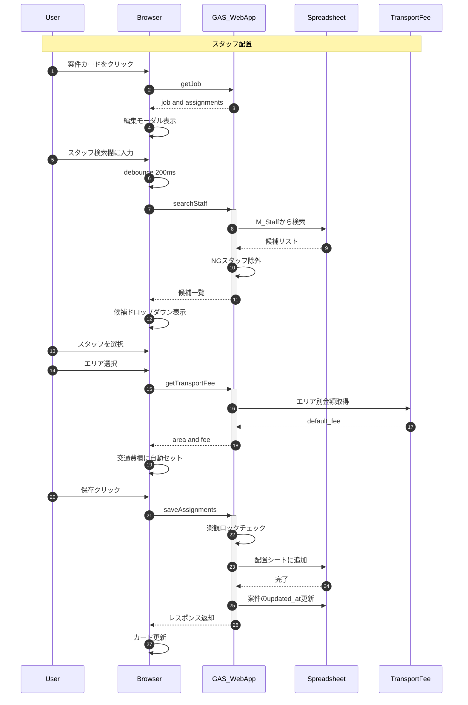

---

## 6. 請求書PDF出力フロー

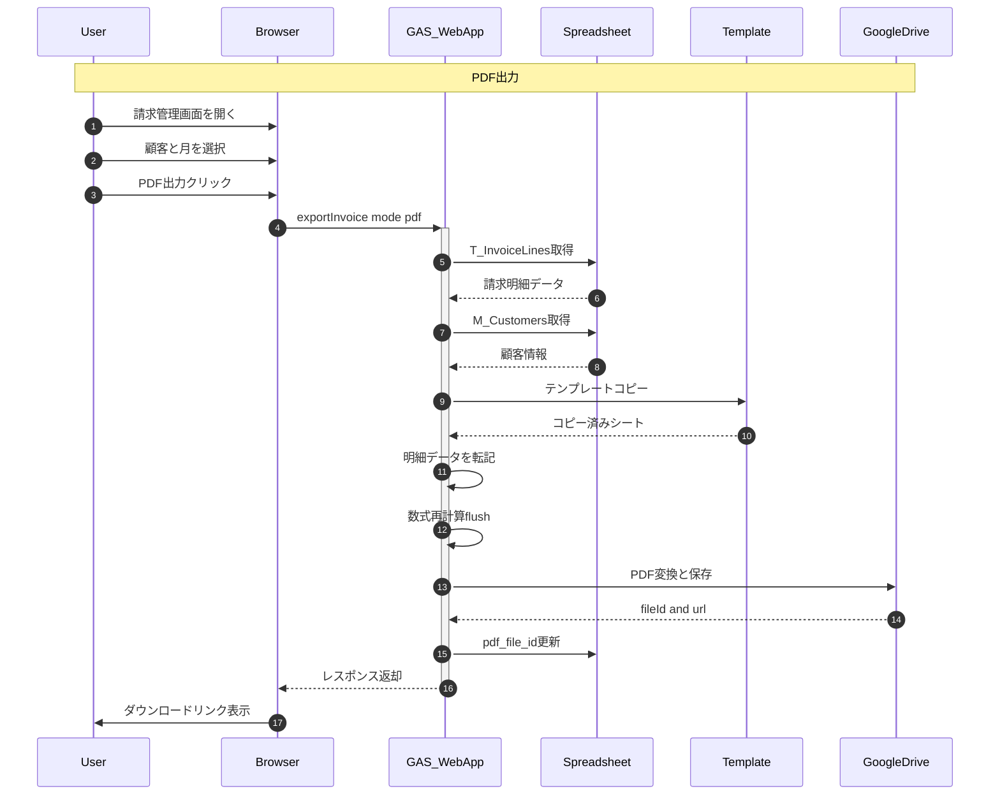

---

## 7. 請求書Excel出力フロー

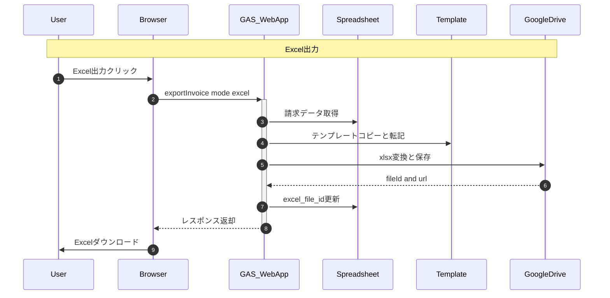

---

## 8. 請求書 編集して出力フロー

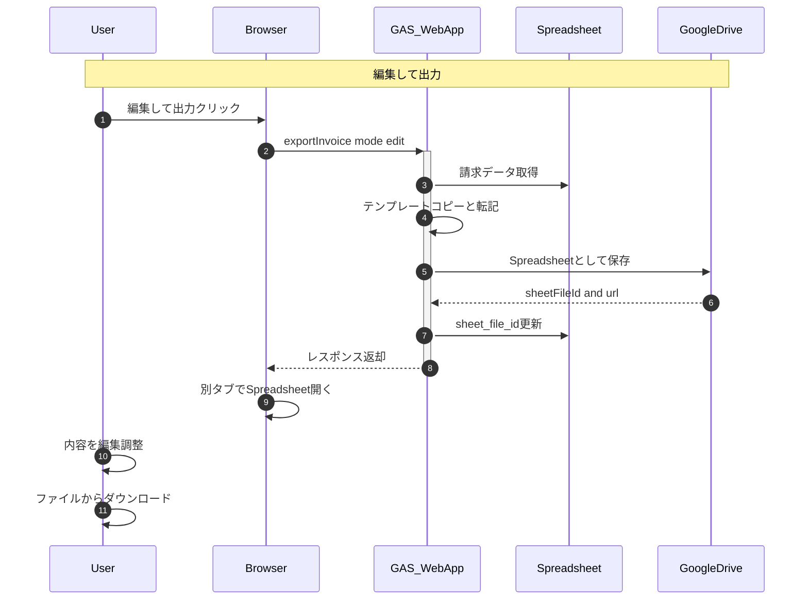

---

## 9. 更新検知フロー（開きっぱなし対策）

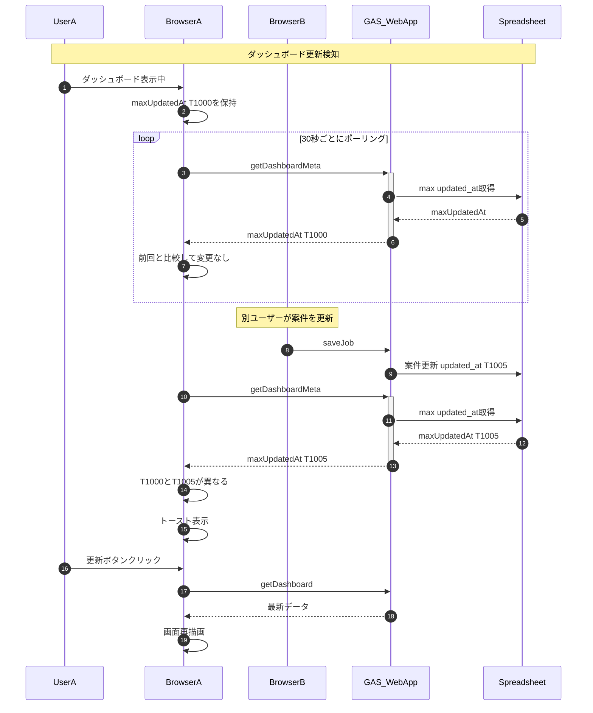

---

## 10. LINEテンプレート生成フロー

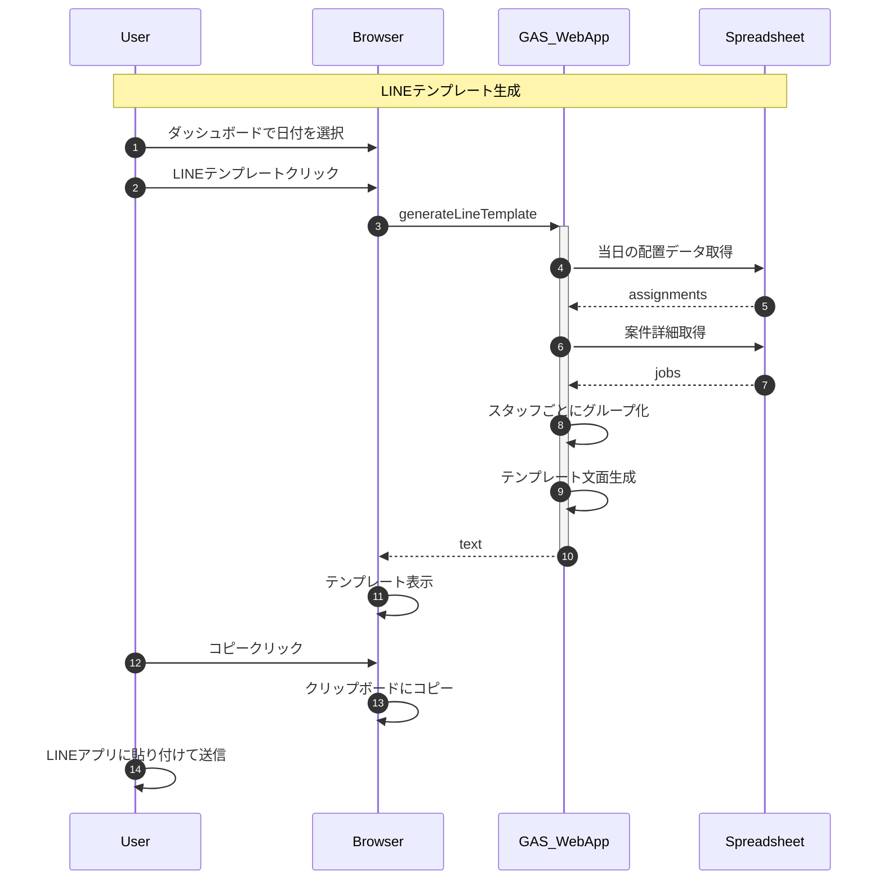

---

## 11. 年度アーカイブフロー

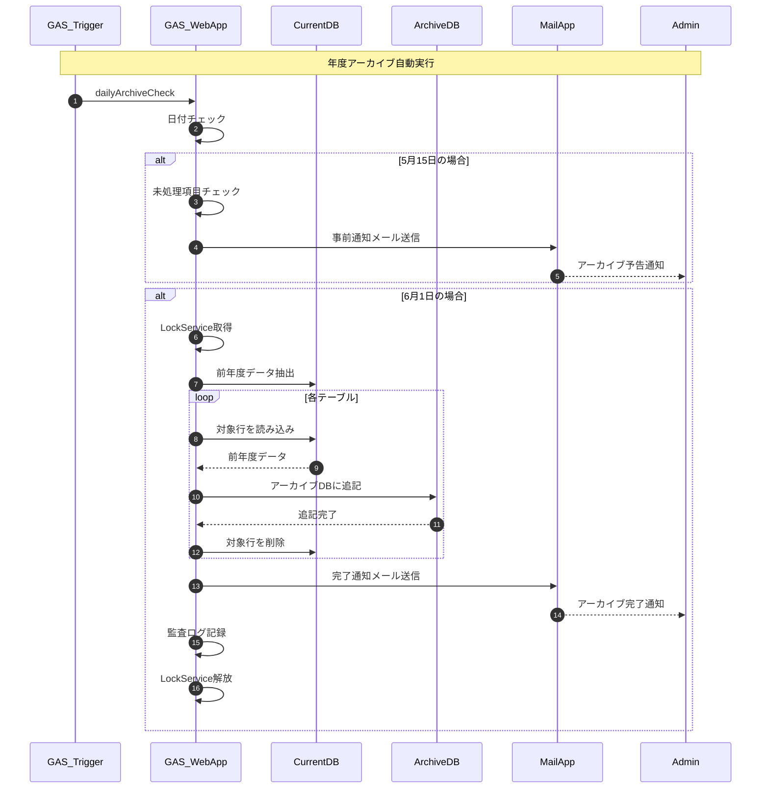

---

## 12. 全体システムフロー概要

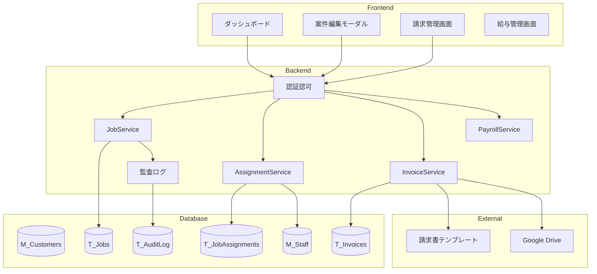

---

## 図の説明

| No | 図名 | 説明 |
|----|------|------|
| 1 | ダッシュボード表示 | 初期アクセスから6列カンバン描画まで |
| 2 | 案件新規登録 | 新規案件の登録フロー |
| 3 | 案件更新-成功 | 楽観ロックによる更新成功パターン |
| 4 | 案件更新-競合 | 同時編集による競合エラーパターン |
| 5 | スタッフ配置 | インクリメンタルサーチと交通費自動セット |
| 6 | PDF出力 | 請求書PDF生成フロー |
| 7 | Excel出力 | 請求書Excel生成フロー |
| 8 | 編集して出力 | Spreadsheet経由の編集出力フロー |
| 9 | 更新検知 | ポーリングによる開きっぱなし対策 |
| 10 | LINEテンプレート | スタッフ連絡用テンプレート生成 |
| 11 | 年度アーカイブ | 自動アーカイブ処理フロー |
| 12 | 全体フロー | システム全体の構成図 |
